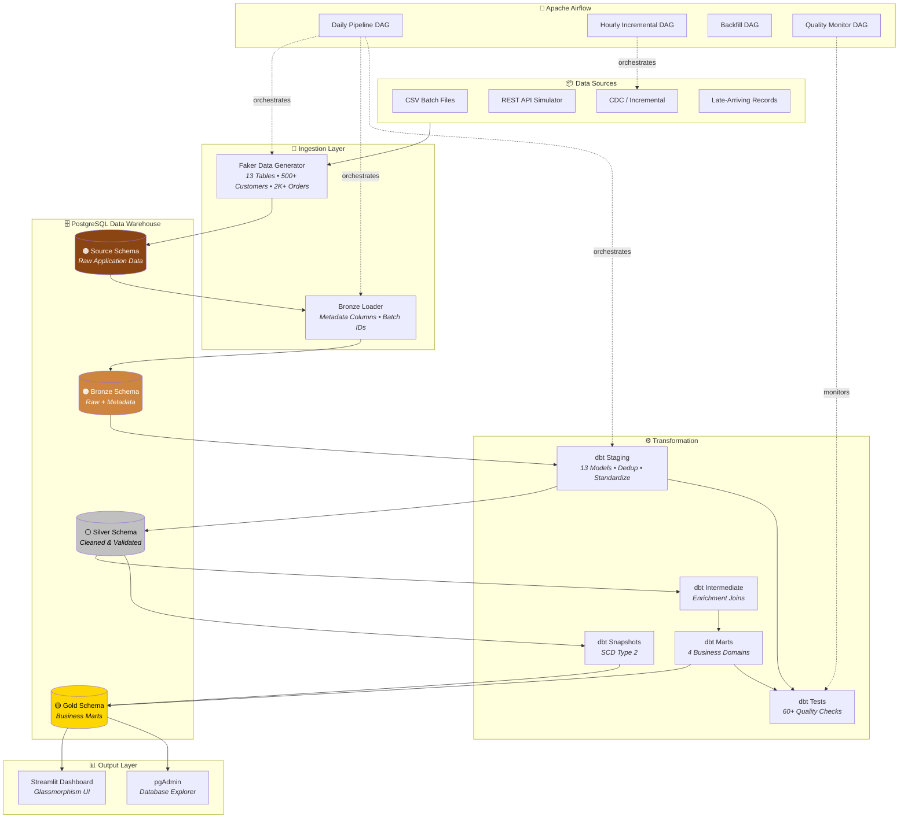

<div align="center">

# 🏪 Retail ELT Platform

### Enterprise-Grade Data Engineering Portfolio Project

**A production-style ELT pipeline built with the Modern Data Stack**
**processing 13 retail data sources through a Medallion Architecture**

[](https://python.org)
[](https://airflow.apache.org)
[](https://getdbt.com)
[](https://postgresql.org)
[](https://docker.com)
[](https://github.com/features/actions)
[](LICENSE)

---

[Architecture](#-architecture) · [Quick Start](#-quick-start) · [Tech Stack](#-tech-stack) · [KPIs](#-kpis-produced) · [Resume Bullets](#-resume-bullet-points)

</div>

---

## 📋 Overview

**Bombay Bazaar** is a fictional Indian retail chain with 12 stores across 4 regions. This platform simulates the complete data engineering lifecycle — from raw transactional data ingestion through to business-ready analytics marts powering executive dashboards.

### Business Problem Solved

> *"Our stores generate thousands of transactions daily across multiple channels. We need a reliable, automated system to ingest, clean, validate, and transform this data into actionable KPIs — enabling leadership to make data-driven decisions on sales performance, customer retention, inventory optimization, and financial health."*

This project demonstrates how a modern data team would build that system — end to end.

---

## 🏗️ Architecture



---

## 🛠️ Tech Stack

| Category | Technology | Purpose |
|----------|-----------|---------|
| **Orchestration** | Apache Airflow 2.7.1 | DAG scheduling, task dependency management, monitoring |
| **Transformation** | dbt 1.6.0 | SQL-based ELT, testing, documentation, snapshots |
| **Warehouse** | PostgreSQL 13 | Data storage across bronze/silver/gold schemas |
| **Containerization** | Docker Compose | Multi-service infrastructure as code |
| **Data Generation** | Faker + Pandas | Realistic synthetic retail data (13 tables) |
| **Dashboard** | Streamlit + Plotly | Real-time executive analytics |
| **CI/CD** | GitHub Actions | Lint, test, SQL validation, dbt compile |
| **Quality** | dbt Tests + Custom | 60+ schema, relationship, and freshness tests |
| **Logging** | Structured JSON | Correlation IDs, pipeline tracing |
| **Dev Tools** | Make, Black, Flake8 | Developer workflow automation |

---

## 🚀 Quick Start

### Prerequisites
- [Docker Desktop](https://www.docker.com/products/docker-desktop) (4GB+ RAM)
- Git

### 3 Commands to Run

```bash
# 1. Clone
git clone https://github.com/Goddex-123/retail-elt-pipeline.git
cd retail-elt-pipeline

# 2. Setup
make setup   # copies .env, builds images

# 3. Launch
make up      # starts Postgres, Airflow, Dashboard, pgAdmin
```

### Access Points

| Service | URL | Credentials |
|---------|-----|-------------|
| **Airflow UI** | [localhost:8080](http://localhost:8080) | `airflow` / `airflow` |
| **Dashboard** | [localhost:8501](http://localhost:8501) | — |
| **pgAdmin** | [localhost:5050](http://localhost:5050) | `admin@retail.com` / `admin` |

### Run the Pipeline
1. Open Airflow UI → find `retail_daily_pipeline`
2. Toggle **ON** → Click ▶️ **Trigger DAG**
3. Watch all task groups execute: Ingestion → Transformation → Marts → Snapshot
4. Visit the Dashboard to see live analytics

---

## 📁 Project Structure

```
retail-elt-pipeline/
├── dags/                           # Airflow DAGs
│   ├── retail_elt_dag.py           #   Daily full pipeline
│   ├── incremental_sales_dag.py    #   Hourly incremental load
│   ├── backfill_dag.py             #   Manual backfill with params
│   ├── data_quality_dag.py         #   SLA & quality monitor
│   └── common/
│       └── callbacks.py            #   Shared alert callbacks
├── dbt_retail/                     # dbt Project
│   ├── models/
│   │   ├── staging/                #   13 Silver models + sources + schema
│   │   ├── intermediate/           #   Enrichment models (ephemeral)
│   │   └── marts/
│   │       ├── sales/              #   fct_orders, daily_sales, monthly_sales, etc.
│   │       ├── customers/          #   CLV, churn_risk, repeat_rate, SCD2
│   │       ├── inventory/          #   stock_alerts, turnover_ratio
│   │       └── finance/            #   refunds, gross_margin, payment_rates
│   ├── macros/                     #   Custom schema naming, utils, tests
│   ├── snapshots/                  #   SCD Type 2 customer snapshot
│   └── profiles.yml                #   Environment-variable driven
├── src/                            # Python utilities package
│   ├── config.py                   #   Centralized configuration
│   ├── logger.py                   #   Structured JSON logging
│   ├── db.py                       #   Connection manager with retry
│   └── utils.py                    #   Timer, chunking, validation
├── scripts/                        # Ingestion scripts
│   ├── data_generator.py           #   13-table Faker generator
│   ├── bronze_loader.py            #   Source → Bronze with metadata
│   ├── incremental_loader.py       #   High-water mark CDC
│   └── api_simulator.py            #   REST API simulation
├── tests/                          # pytest test suite
│   ├── test_data_generator.py      #   Data generation tests
│   ├── test_config.py              #   Configuration tests
│   └── test_utils.py               #   Utility function tests
├── dashboard/                      # Streamlit analytics app
│   └── app.py                      #   Glassmorphism executive dashboard
├── streaming/                      # Optional Spark streaming
│   └── spark_streaming.py          #   Kafka consumer (optional)
├── docs/                           # Documentation
│   ├── architecture.md             #   Architecture decisions & patterns
│   ├── data_dictionary.md          #   All tables & columns documented
│   └── deployment.md               #   Local & cloud deployment guide
├── configs/
│   └── pipeline.yml                #   Central pipeline configuration
├── .github/workflows/
│   └── ci.yml                      #   4-job CI pipeline
├── docker-compose.yml              #   Main infrastructure
├── docker-compose.streaming.yml    #   Optional Kafka/Zookeeper
├── Makefile                        #   Dev workflow automation
├── requirements.txt                #   Core dependencies
├── requirements-dev.txt            #   Dev/test dependencies
├── .env.example                    #   Environment template
├── .gitignore                      #   Comprehensive ignore rules
└── LICENSE                         #   MIT License
```

---

## 📊 KPIs Produced

### Sales Analytics
- **Daily / Monthly Revenue** — with running totals, 7-day moving averages, DoD/MoM growth
- **Revenue by Region** — contribution %, per-store performance, ranking
- **Top Products** — Pareto analysis (80/20 rule), revenue & unit rankings

### Customer Analytics
- **Customer Lifetime Value** — RFM scoring (Recency, Frequency, Monetary)
- **Customer Segmentation** — Champions, Loyal, New, At Risk, Hibernating
- **Churn Risk Scoring** — 0-100 risk score with win-back prioritization
- **Repeat Purchase Rate** — Monthly cohort analysis

### Inventory Intelligence
- **Stock Alerts** — Critical/High/Medium severity with reorder suggestions
- **Inventory Turnover** — Fast-moving vs dead stock classification

### Financial Health
- **Gross Margin Analysis** — Per-product margin tiers
- **Refund Analysis** — Return rates by reason category
- **Payment Success Rates** — Method reliability with tier classification

---

## 🧰 Data Engineering Patterns Implemented

| Pattern | Implementation |
|---------|---------------|
| **Medallion Architecture** | Bronze → Silver → Gold with schema isolation |
| **SCD Type 2** | dbt snapshot tracking customer attribute changes |
| **Incremental Models** | `fct_orders` with `is_incremental()` filtering |
| **Idempotent Pipelines** | Truncate-and-load with transaction safety |
| **High-Water Mark** | Incremental loader tracks max timestamp |
| **CDC Simulation** | Simulated change data capture for orders |
| **Star Schema** | Fact + dimension tables in gold layer |
| **Data Quality Gates** | 60+ dbt tests blocking bad data from gold |
| **Structured Logging** | JSON logs with correlation IDs |
| **Config-Driven Pipeline** | YAML config + environment variables |
| **Retry with Backoff** | Exponential backoff on DB connections |
| **Task Groups** | Airflow DAG organization by pipeline stage |
| **Parameterized Runs** | Backfill DAG with date range params |

---

## 📝 Resume Bullet Points

> Use these when describing this project on your resume:

- **Architected** an enterprise ELT platform processing **13 retail data sources** through a **Medallion Architecture** (Bronze → Silver → Gold), delivering **15+ business-ready analytics marts**
- **Built** 4 orchestrated **Apache Airflow DAGs** (daily, hourly incremental, backfill, quality monitor) with **SLA tracking**, task groups, and exponential retry backoff
- **Implemented** **60+ dbt data quality tests** including referential integrity, freshness checks, and custom anomaly detection — achieving **zero bad-data leakage** to the gold layer
- **Designed** a **star schema** with **SCD Type 2 customer dimension** using dbt snapshots, enabling historical trend analysis on customer attribute changes
- **Developed** an **RFM-based customer segmentation model** producing Customer Lifetime Value, churn risk scores, and win-back prioritization for 500+ customers
- **Created** a real-time **Streamlit executive dashboard** with glassmorphism UI, connected directly to the PostgreSQL data warehouse for live KPI visualization
- **Established** CI/CD with **GitHub Actions** (lint, pytest, SQL validation, dbt compile) and developer workflow automation via **Makefile** with 15+ targets
- **Applied** data engineering best practices: idempotent pipelines, config-driven architecture, structured JSON logging with correlation IDs, and environment-variable-based credential management

---

## 🔮 Future Improvements

- [ ] **Snowflake** — Migrate warehouse from PostgreSQL to Snowflake
- [ ] **Great Expectations** — Add expectation suites for advanced validation
- [ ] **Apache Spark** — Scale transformations for 100M+ row datasets
- [ ] **Real-time Streaming** — Activate Kafka → Spark → warehouse pipeline
- [ ] **dbt Metrics Layer** — Implement Semantic Layer for consistent metric definitions
- [ ] **Alerting** — Slack/PagerDuty integration for pipeline failures
- [ ] **Data Catalog** — Add OpenMetadata or DataHub for discovery
- [ ] **Cost Optimization** — Implement table partitioning for large fact tables
- [ ] **Row-Level Security** — Add RLS policies for multi-tenant access
- [ ] **Terraform** — Infrastructure as Code for cloud deployment

---

## 📄 License

This project is licensed under the MIT License — see the [LICENSE](LICENSE) file for details.

---

<div align="center">

**Built with ❤️ for Data Engineering**

*Soham Barate • [GitHub](https://github.com/Goddex-123) • BSc Data Science*

</div>
