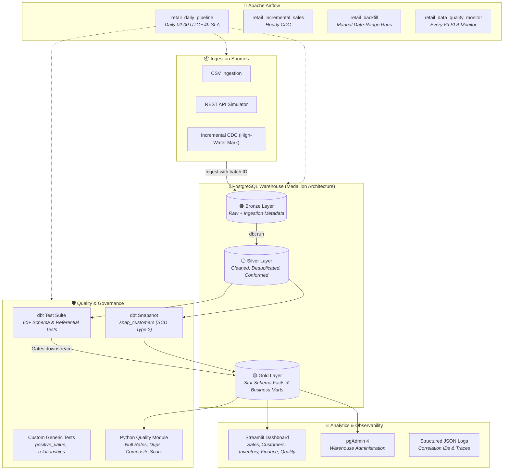

<div align="center">

# 🏪 Retail ELT Platform

### Production-Oriented Data Engineering Platform

**An end-to-end ELT pipeline built with the Modern Data Stack (Airflow, dbt, PostgreSQL, Docker, Streamlit)**  
**processing 13 retail data sources through a Medallion Architecture with automated data quality gates.**

[](https://github.com/Goddex-123/retail-elt-pipeline/actions/workflows/ci.yml)
[](https://python.org)
[](https://airflow.apache.org)
[](https://getdbt.com)
[](https://postgresql.org)
[](https://docker.com)
[](LICENSE)

---

[Executive Summary](#-executive-summary) · [Architecture](#-architecture) · [Quick Start](#-quick-start) · [Recruiter / Demo Walkthrough](#-recruiter--demo-walkthrough) · [Design Decisions](#-key-design-decisions) · [Tech Stack](#-tech-stack) · [Data Quality](#-data-quality--observability)

</div>

---

## 📋 Executive Summary

**Bombay Bazaar** is a multi-channel retail enterprise operating 12 stores across 4 regions with thousands of daily transactions. Raw transactional data arrives from disparate sources containing real-world data quality issues: duplicate records, null values, inconsistent casing, negative quantities from legacy POS systems, and clock-skewed timestamps.

This platform provides an automated, production-style data foundation that:
1. **Ingests** 13 operational tables into an append-only Bronze data lake with strict lineage metadata (`_loaded_at`, `_batch_id`).
2. **Transforms & Cleanses** data through dbt Silver staging views and intermediate enrichment models.
3. **Guarantees Quality** with 60+ blocking dbt tests, custom SQL generic tests (`positive_value`), and an automated Python Data Quality Index report.
4. **Delivers Business Marts** (Gold layer star schema, SCD Type 2 customer history, RFM customer segmentation, Churn scoring, and stock replenishments).
5. **Visualizes Analytics** via a modern, restrained Streamlit executive dashboard featuring 5 business domains, real-time telemetry, and zero-dependency offline resilience.

---

## 🏗️ Architecture



---

## 🛠️ Tech Stack

| Category | Technology | Implementation Detail |
|---|---|---|
| **Orchestration** | Apache Airflow 2.7.1 | Task groups, SLAs, failure callbacks, exponential retry backoff, timeouts |
| **Data Transformation** | dbt-postgres 1.6.0 | 13 staging models, ephemeral intermediate models, 14 dimensional marts, snapshots |
| **Data Warehouse** | PostgreSQL 13 | Schema-isolated Medallion architecture (`source`, `bronze`, `silver`, `gold`) |
| **Containerization** | Docker Compose | Multi-container orchestration with dependency healthchecks and pinned images |
| **Analytics Dashboard** | Streamlit + Plotly | Minimal dark analytics interface with 5 domain views, cached queries, and diagnostic telemetry |
| **CI/CD Automation** | GitHub Actions | 5-job automated pipeline (Lint, Unit Tests, DAG Validation, SQLFluff, dbt Compile) |
| **Data Quality** | dbt Tests + Custom Engine | 60+ declarative assertions, custom macros, and automated Python telemetry |
| **Observability** | Structured JSON Logging | Thread-safe `LoggerAdapter` with `correlation_id` injection across pipeline stages |

---

## 🚀 Quick Start

### Prerequisites
- [Docker Desktop](https://www.docker.com/products/docker-desktop) (Docker Compose v2+)
- Python 3.9+ (optional, for local development outside Docker)

### Option A: One-Command Demo Launch (Recommended)
Clone the repository and run the automated demo bootstrap script:
```bash
git clone https://github.com/Goddex-123/retail-elt-pipeline.git
cd retail-elt-pipeline

# Linux / macOS / Git Bash:
chmod +x scripts/init_demo.sh
./scripts/init_demo.sh
```

### Option B: Step-by-Step Launch
```bash
# 1. Initialize environment configuration
cp .env.example .env

# 2. Start warehouse and orchestration services
docker compose up -d

# 3. Access web services
# Airflow UI:   http://localhost:8080  (Credentials in .env)
# Dashboard:    http://localhost:8501
# pgAdmin:      http://localhost:5050  (admin@retail.com / admin)
```

---

## 🎥 Recruiter / Demo Walkthrough

Follow this 5-step sequence when conducting a live screen recording or technical demonstration:

1. **Service Verification & Container Health**:
   - Run `docker compose ps` to demonstrate that PostgreSQL, Airflow, and Streamlit are healthy with non-root isolation and secure port mappings.
2. **Airflow DAG Execution**:
   - Open [Airflow UI (localhost:8080)](http://localhost:8080).
   - Show `retail_daily_pipeline`. Explain the task groups (`ingestion` → `transformation` → `marts` → `snapshot` → `quality_report`).
   - Trigger the DAG and inspect the live execution graph and task logs showing structured JSON logs and correlation IDs.
3. **Data Quality & Testing Gates**:
   - Highlight the dbt test execution in the task logs: show how invalid source inputs (negative quantities, dirty city names, duplicates) are quarantined and transformed in Silver before reaching Gold.
   - Point out the custom generic test `positive_value` and foreign key relationships.
4. **Interactive Analytics Dashboard**:
   - Navigate to [Streamlit Dashboard (localhost:8501)](http://localhost:8501).
   - **Sales Analytics**: Review daily run-rate with 7-day moving averages, regional Pareto distribution, and store-level contribution.
   - **Customer Intelligence**: Walk through RFM segmentation cohorts, churn risk progression, and actionable high-priority win-back queue.
   - **Inventory & Supply**: Inspect multi-tier stockout severity alerts (`critical`, `high`, `medium`) and inventory velocity classification.
   - **Financial Health**: Review payment gateway reliability tiers, product gross margin leaders, and return reason categories.
   - **Pipeline Health & Quality**: Inspect live data freshness tracking, row volume counters, and the dbt Gold mart audit table.
5. **Warehouse Querying in pgAdmin / Terminal**:
   - Query `gold.dim_customers_scd2` to demonstrate SCD Type 2 historical change tracking (`valid_from`, `valid_to`, `is_current`).

---

## 🧠 Key Design Decisions & Trade-offs

### 1. Why Medallion Architecture in PostgreSQL?
*Decision*: Use explicit PostgreSQL schemas (`source`, `bronze`, `silver`, `gold`) rather than a single flat database.  
*Rationale*: Provides complete logical separation between raw immutable landing data, conformed clean models, and user-facing business marts. Prevents analytics queries from impacting raw ingestion and makes migration to Snowflake or BigQuery a drop-in replacement.

### 2. Why High-Water Mark CDC over Full Truncate-and-Load?
*Decision*: Implement incremental high-water mark loading (`scripts/incremental_loader.py` and `dbt incremental`).  
*Rationale*: In a production retail environment with millions of daily transactions, full refreshes degrade warehouse IO and network bandwidth. The high-water mark loads only records where `order_date > MAX(order_date)`.

### 3. Why dbt Snapshots for SCD Type 2?
*Decision*: Implement `snap_customers.sql` using dbt's native snapshot mechanism.  
*Rationale*: Hand-rolling SCD2 merges in Python is prone to race conditions and lock contention. dbt handles snapshot state comparison, effective date windowing (`dbt_valid_from`, `dbt_valid_to`), and null termination natively and deterministically.

### 4. Why Scoped Structured JSON Logging?
*Decision*: Replace global logging factories with a scoped `LoggerAdapter` pattern.  
*Rationale*: Global logging hooks cause side-effects across third-party libraries (like Airflow itself). The adapter pattern injects `correlation_id` and pipeline context without polluting global runtime state.

---

## 🛡️ Data Quality & Observability

### Declarative dbt Tests
The project features **60+ tests** verifying every stage of the pipeline:
- **Primary Keys**: `unique`, `not_null` on all dimension and fact surrogate keys.
- **Referential Integrity**: `relationships` tests enforcing valid foreign keys across all staging models.
- **Domain Constraints**: `accepted_values` on payment methods, order statuses, regions, and loyalty tiers.
- **Custom Business Rules**: `positive_value` ensuring non-zero unit prices and transaction values.

### Python Data Quality Engine (`src/quality.py`)
Produces automated quality audits on every pipeline run:
- Null percentage checks against SLA thresholds
- Duplicate rate detection
- Schema integrity and row volume minimums
- Composite Quality Score output directly to Airflow logs and Streamlit dashboard

---

## 📁 Repository Structure

```
retail-elt-pipeline/
├── .github/workflows/
│   └── ci.yml                      # 5-job GitHub Actions CI pipeline
├── configs/
│   └── pipeline.yml                # Central YAML pipeline configuration
├── dags/                           # Production Airflow DAGs
│   ├── common/
│   │   ├── __init__.py
│   │   └── callbacks.py            # Structured failure & SLA callbacks
│   ├── retail_elt_dag.py           # Main daily Medallion pipeline
│   ├── incremental_sales_dag.py    # Hourly CDC incremental load
│   ├── backfill_dag.py             # Parameterized historical backfill
│   └── data_quality_dag.py         # Standalone 6-hour quality & SLA monitor
├── dashboard/                      # Streamlit executive dashboard
│   ├── app.py                      # Multi-tab analytics & data health UI
│   └── requirements.txt            # Dashboard specific dependencies
├── dbt_retail/                     # dbt Core transformation project
│   ├── macros/                     # Custom SQL macros & test_positive_value
│   ├── models/
│   │   ├── staging/                # 13 silver staging models & schema tests
│   │   ├── intermediate/           # Ephemeral business logic joins
│   │   └── marts/                  # Gold layer dimensional marts (Sales, Customers, Inventory, Finance)
│   ├── snapshots/                  # snap_customers.sql (SCD Type 2)
│   └── dbt_project.yml
├── docs/                           # Architecture & data dictionaries
│   ├── architecture.md             # In-depth architectural & scaling guide
│   └── data_dictionary.md          # Full warehouse table & column reference
├── scripts/                        # Ingestion & automation scripts
│   ├── init_demo.sh                # One-command demo environment setup
│   ├── data_generator.py           # 13-table Faker data generation
│   ├── bronze_loader.py            # Source → Bronze loader with audit metadata
│   ├── incremental_loader.py       # SQL-injection-safe CDC high-water mark loader
│   └── api_simulator.py            # REST API ingestion simulator
├── src/                            # Core Python library
│   ├── config.py                   # Type-safe configuration dataclasses
│   ├── db.py                       # Connection manager, transactions & retry backoff
│   ├── logger.py                   # Scoped structured JSON logger with correlation IDs
│   ├── quality.py                  # Automated data quality report generator
│   └── utils.py                    # Timer, chunking, and validation utilities
├── streaming/                      # Optional PySpark & Kafka components
│   ├── spark_streaming.py          # Real-time streaming consumer (experimental)
│   └── requirements-streaming.txt  # Isolated streaming dependencies
├── tests/                          # 59+ automated unit & integration tests
│   ├── test_bronze_loader.py       # Bronze layer metadata & batch tests
│   ├── test_config.py              # Configuration validation tests
│   ├── test_dag_import.py          # Airflow DAG parse & structural tests
│   ├── test_dashboard.py           # Streamlit compilation, offline fallback & render tests
│   ├── test_data_generator.py      # Faker generation & edge case tests
│   ├── test_incremental_loader.py # CDC logic & SQL-injection protection tests
│   ├── test_quality.py             # Data quality scoring tests
│   └── test_utils.py               # Utility & edge case tests
├── docker-compose.yml              # Core production stack
├── docker-compose.streaming.yml    # Optional Kafka/Zookeeper stack
├── Makefile                        # 15+ developer automation targets
├── requirements.txt                # Core production dependencies
└── requirements-dev.txt            # Test & linting dependencies
```

---

## ⚖️ Engineering Limitations & Honest Trade-offs

- **Single-Node Warehouse**: PostgreSQL is utilized for demo accessibility and local resource efficiency. For 100M+ row production workloads, the gold models are architected to migrate seamlessly to Snowflake or BigQuery.
- **Batch Cadence**: Core delivery is scheduled at daily (02:00 UTC) and hourly frequencies. Real-time streaming with Kafka and Spark is provided as an optional isolated module for sub-minute latency requirements.
- **Synthetic Data**: The pipeline utilizes synthetic generation simulating enterprise retail patterns (including intentional dirty data) to provide a self-contained demonstration environment without proprietary data exposure.

---

## 📝 Resume Bullet Points

- **Architected** a production-oriented retail ELT platform processing **13 data sources** through a **Medallion Architecture** (Bronze/Silver/Gold) on PostgreSQL and dbt Core.
- **Orchestrated** 4 Apache Airflow DAGs with task groups, execution timeouts, custom SLA monitoring, and structured JSON failure alerting.
- **Implemented** **60+ dbt tests** (schema, referential integrity, and custom generic SQL assertions) combined with an automated Python data quality scoring engine.
- **Engineered** an **SCD Type 2 customer dimension** using dbt snapshots and an incremental CDC pipeline with parameterized high-water mark extraction.
- **Developed** an **RFM customer segmentation model**, churn prediction scoring, and inventory replenishment alerts powering a modern, restrained Streamlit executive dashboard.
- **Established** a complete CI/CD pipeline using **GitHub Actions** enforcing linting, 59+ automated pytest test cases, SQLFluff validation, and dbt compilation.

---

## 📄 License

This project is licensed under the MIT License — see the [LICENSE](LICENSE) file for details.

<div align="center">

**Built by Soham Barate**  
*Aspiring Data Engineer • [GitHub Profile](https://github.com/Goddex-123)*

</div>
