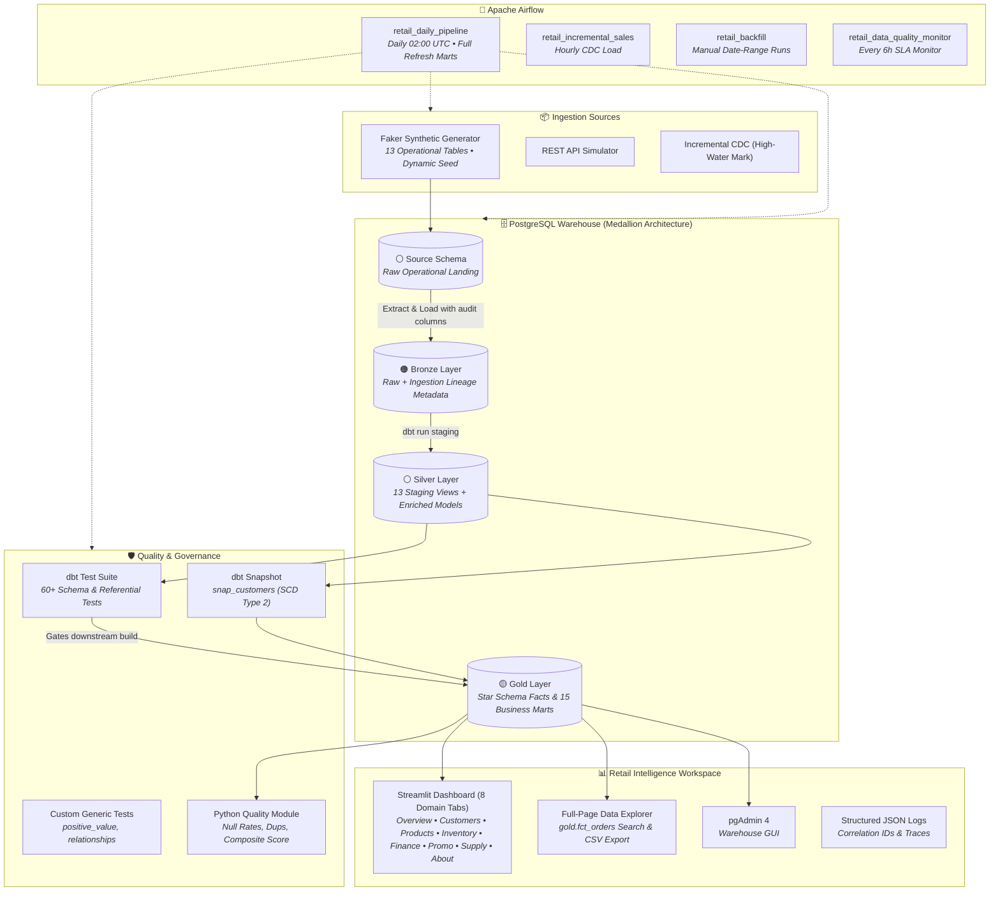

<div align="center">

# 🏪 Bombay Bazaar — Enterprise Retail ELT Platform

### Production-Oriented Data Engineering & Analytics Workspace

**An end-to-end ELT platform built with the Modern Data Stack (Airflow, dbt Core, PostgreSQL, Docker, Streamlit)**  
**processing 13 retail data sources through a Medallion Architecture with automated data quality gates and a glassmorphic analytical workspace.**

[](https://github.com/Soham-Barate/retail-elt-pipeline/actions/workflows/ci.yml)
[](https://python.org)
[](https://airflow.apache.org)
[](https://getdbt.com)
[](https://postgresql.org)
[](https://docker.com)
[](https://streamlit.io)
[](LICENSE)

---

[Executive Summary](#-executive-summary) · [Architecture](#-architecture) · [Analytics Workspace](#-analytics-workspace--uiux-design-system) · [Quick Start](#-quick-start) · [Recruiter Walkthrough](#-recruiter--demo-walkthrough) · [Repository Structure](#-repository-structure) · [Design Decisions](#-key-design-decisions) · [Tech Stack](#-tech-stack) · [Data Quality](#-data-quality--observability)

</div>

---

## 📋 Executive Summary

**Bombay Bazaar** is a multi-channel retail enterprise operating 12 stores across 4 regions with thousands of daily transactions. Raw operational data arrives from disparate sources containing real-world data quality issues: duplicate records, null values, inconsistent casing, negative quantities from legacy POS systems, and clock-skewed timestamps.

This platform provides an automated, production-grade data foundation that:
1. **Ingests** 13 operational tables into an append-only Bronze data lake with strict lineage metadata (`_loaded_at`, `_batch_id`, `_source`).
2. **Transforms & Cleanses** data through dbt Silver staging views and intermediate enrichment models.
3. **Guarantees Quality** with 60+ blocking dbt tests, custom SQL generic tests (`positive_value`), and an automated Python Data Quality Index report.
4. **Delivers Business Marts** (Gold layer star schema, SCD Type 2 customer history, RFM customer segmentation, Churn scoring, and stock replenishments).
5. **Visualizes Analytics** via a modern, glassmorphic Streamlit intelligence workspace featuring 8 domain tabs, dynamic executive insights calculated on the fly, zero-white scrollbars, and a full-page Excel-style raw data explorer with CSV export.

---

## 🏗️ Architecture


```mermaid
flowchart TB
    subgraph Sources["📦 Ingestion Sources"]
        GEN["Faker Synthetic Generator<br/><i>13 Operational Tables • Dynamic Seed</i>"]
        API["REST API Simulator"]
        CDC["Incremental CDC (High-Water Mark)"]
    end

    subgraph Orchestration["🎯 Apache Airflow"]
        DAG1["retail_daily_pipeline<br/><i>Daily 02:00 UTC • Full Refresh Marts</i>"]
        DAG2["retail_incremental_sales<br/><i>Hourly CDC Load</i>"]
        DAG3["retail_backfill<br/><i>Manual Date-Range Runs</i>"]
        DAG4["retail_data_quality_monitor<br/><i>Every 6h SLA Monitor</i>"]
    end

    subgraph Warehouse["🗄️ PostgreSQL Warehouse (Medallion Architecture)"]
        direction TB
        SRC[("⚪ Source Schema<br/><i>Raw Operational Landing</i>")]
        BRZ[("🟠 Bronze Layer<br/><i>Raw + Ingestion Lineage Metadata</i>")]
        SLV[("⚪ Silver Layer<br/><i>13 Staging Views + Enriched Models</i>")]
        GLD[("🟡 Gold Layer<br/><i>Star Schema Facts & 15 Business Marts</i>")]
    end

    subgraph Quality["🛡️ Quality & Governance"]
        DBT_TEST["dbt Test Suite<br/><i>60+ Schema & Referential Tests</i>"]
        CUSTOM_TEST["Custom Generic Tests<br/><i>positive_value, relationships</i>"]
        SCD2["dbt Snapshot<br/><i>snap_customers (SCD Type 2)</i>"]
        PY_QUAL["Python Quality Module<br/><i>Null Rates, Dups, Composite Score</i>"]
    end

    subgraph Analytics["📊 Retail Intelligence Workspace"]
        DASH["Streamlit Dashboard (8 Domain Tabs)<br/><i>Overview • Customers • Products • Inventory • Finance • Promo • Supply • About</i>"]
        EXPLORER["Full-Page Data Explorer<br/><i>gold.fct_orders Search & CSV Export</i>"]
        PGADMIN["pgAdmin 4<br/><i>Warehouse GUI</i>"]
        LOGS["Structured JSON Logs<br/><i>Correlation IDs & Traces</i>"]
    end

    GEN --> SRC
    SRC -->|Extract & Load with audit columns| BRZ
    BRZ -->|dbt run staging| SLV
    SLV --> DBT_TEST
    DBT_TEST -->|Gates downstream build| GLD
    SLV --> SCD2 --> GLD
    GLD --> PY_QUAL
    GLD --> DASH
    GLD --> EXPLORER
    GLD --> PGADMIN
    DAG1 -.-> Sources
    DAG1 -.-> Warehouse
    DAG1 -.-> Quality
```

---

## 🎨 Analytics Workspace & UI/UX Design System

The analytics interface ([`dashboard/app.py`](file:///d:/Soham_1/retail-elt-pipeline/dashboard/app.py) & [`dashboard/ui.py`](file:///d:/Soham_1/retail-elt-pipeline/dashboard/ui.py)) has been engineered as a **modern, glassmorphic analytics workspace** inspired by contemporary data products (Linear, Raycast, Vercel):

### 1. Curated 4-Font Typography System
* **`Playfair Display` (Luxury Serif)**: Brand identity (*Bombay Bazaar*), hero titles (*Retail Intelligence*), and narrative headers.
* **`Plus Jakarta Sans` (Neo-Grotesque Sans)**: Clean UI controls, sidebar filters, navigation tabs, and body copy.
* **`Space Grotesk` (Technical Sans)**: Uppercase category kickers (*DATA CONTROLS*, *NET REVENUE*, *REGION*).
* **`JetBrains Mono` (Tabular Monospace)**: High-precision numbers with tabular alignment for currency (`₹99.7L`, `₹1.03Cr`), percentages, counts, order IDs, and pipeline timestamps.

### 2. Balanced Dark Glassmorphism
* **Canvas**: Deep slate neutral `#0b0d10` (no eye fatigue, zero red/warm tint).
* **Glass Panels**: `rgba(255, 255, 255, 0.028)` elevated cards with `20px` backdrop blur and subtle `1px` translucent borders.
* **Zero White Scrollbars**: Enforced `color-scheme: dark !important` globally across Chromium, Firefox, WebKit, Streamlit internal dataframes, and sidebar.
* **Harmonized Colors**: Refined champagne gold accent (`#dfb15b`), emerald success (`#4ade80`), amber warning (`#fbbf24`), and coral risk (`#f87171`) with equalized perceptual luminance.
* **Adaptive Currency**: Formats currency with the Indian Rupee symbol using adaptive magnitudes (`₹1.03Cr`, `₹99.7L`, `₹5.0K`).

### 3. Comprehensive Domain Analytics (8 Tabs)
1. **Overview**: Executive KPI rail (Net Revenue, Orders, AOV, Gross Margin, Return Rate), dynamic Revenue Trend area chart, Regional Performance horizontal bar chart (clip-free labels), Sales Performance matrix, Order Status Mix, and Revenue by Region donut.
2. **Customers**: RFM Customer Segments distribution, CLV histogram, and At-Risk/Churned Customer win-back priority queue.
3. **Products**: Top Products by Revenue, Profitability & Margin Tier breakdown, and Cumulative Revenue 80/20 Pareto curve.
4. **Inventory**: Stock Alert severity tiers (*Critical*, *Warning*, *Normal*), low stock telemetry, and Inventory Turnover velocity metrics.
5. **Finance**: Payment Gateway Reliability tiers, Refund Rate by Category, and Daily Refund volume trends.
6. **Promotions**: Promotional campaign ROI matrix (incremental revenue, discount depth, order lift).
7. **Supply Chain**: Carrier Delivery Performance, Shipping Mode distribution, and On-Time Delivery rates.
8. **About**: Dynamic Executive Insights calculated live from active filters, end-to-end Medallion Pipeline Architecture, Metric Definitions, and Data Lineage.
9. **Interactive Data Explorer**: Instant full-page raw data grid for `gold.fct_orders` with full-column search and one-click CSV download.

---

## 🛠️ Tech Stack

| Category | Technology | Implementation Detail |
|---|---|---|
| **Orchestration** | Apache Airflow 2.7.1 | Task groups, SLAs, failure callbacks, exponential retry backoff, timeouts |
| **Data Transformation** | dbt-postgres 1.6.0 | 13 staging models, ephemeral intermediate models, 15 dimensional & fact marts, snapshots |
| **Data Warehouse** | PostgreSQL 13 | Schema-isolated Medallion architecture (`source`, `bronze`, `silver`, `gold`) |
| **Containerization** | Docker Compose | Multi-container orchestration with dependency healthchecks and pinned images |
| **Analytics Workspace** | Streamlit 1.28 + Plotly | Glassmorphic dark UI, multi-font typography, 8 domain views, cached queries, telemetry |
| **CI/CD Automation** | GitHub Actions | 5-job automated pipeline (Lint, Unit Tests, DAG Validation, SQLFluff, dbt Compile) |
| **Data Quality** | dbt Tests + Custom Engine | 60+ declarative assertions, custom macros (`positive_value`), and automated Python telemetry |
| **Observability** | Structured JSON Logging | Thread-safe `LoggerAdapter` with `correlation_id` injection across pipeline stages |

---

## 🚀 Quick Start

### Prerequisites
- [Docker Desktop](https://www.docker.com/products/docker-desktop) (Docker Compose v2+)
- Python 3.9+ (optional, for local development outside Docker)

### Option A: One-Command Launch (Recommended)
```bash
git clone https://github.com/Soham-Barate/retail-elt-pipeline.git
cd retail-elt-pipeline

# Start all containers in the background
docker compose up -d
```

### Option B: Access Web Services
* **Streamlit Dashboard**: [http://localhost:8501](http://localhost:8501)
* **Airflow UI**: [http://localhost:8080](http://localhost:8080) *(Username: `airflow` / Password: `airflow`)*
* **pgAdmin 4**: [http://localhost:5050](http://localhost:5050) *(Email: `admin@retail.com` / Password: `admin`)*

---

## 🎥 Recruiter / Demo Walkthrough

Follow this 5-step sequence when conducting a live screen recording or technical demonstration:

1. **Service Verification & Container Health**:
   * Run `docker compose ps` to demonstrate that PostgreSQL, Airflow, and Streamlit are healthy with non-root isolation and secure port mappings.
2. **Airflow DAG Execution & Fresh Data Generation**:
   * Open [Airflow UI (localhost:8080)](http://localhost:8080).
   * Trigger `retail_daily_pipeline`. Explain the task groups (`ingestion` → `transformation` → `snapshot` → `marts` → `quality_report`).
   * Because fact generation uses a dynamic timestamp seed, every retrigger generates **brand new transactions, order dates, and revenue figures**.
3. **Data Quality & Testing Gates**:
   * Highlight the dbt test execution in the task logs: show how invalid source inputs (negative quantities, dirty city names, duplicates) are quarantined and transformed in Silver before reaching Gold.
   * Point out the custom generic test `positive_value` and foreign key referential integrity checks.
4. **Interactive Analytics Dashboard**:
   * Navigate to [Streamlit Dashboard (localhost:8501)](http://localhost:8501).
   * Click **"Refresh data"** in the sidebar: Streamlit instantly evicts cache and re-queries PostgreSQL, updating all KPIs (Net Revenue, Orders, AOV, Gross Margin), trend charts, and tables in real time.
   * Toggle between the 8 domain tabs and test the full-page **Data Explorer**.
5. **Warehouse Querying in pgAdmin / Terminal**:
   * Query `gold.dim_customers_scd2` to demonstrate SCD Type 2 historical change tracking (`valid_from`, `valid_to`, `is_current`).

---

## 📁 Repository Structure

```
retail-elt-pipeline/
├── .github/workflows/
│   └── ci.yml                      # 5-job GitHub Actions CI pipeline
├── configs/
│   └── pipeline.yml                # Central YAML pipeline configuration
├── dags/                           # Production Airflow DAGs
│   ├── common/
│   │   ├── __init__.py
│   │   └── callbacks.py            # Structured failure & SLA callbacks
│   ├── retail_elt_dag.py           # Daily full pipeline (Generate → Bronze → Silver → Gold)
│   ├── incremental_sales_dag.py    # Hourly CDC incremental load
│   ├── backfill_dag.py             # Parameterized historical backfill
│   └── data_quality_dag.py         # Standalone 6-hour quality & SLA monitor
├── dashboard/                      # Retail Intelligence Analytics Workspace
│   ├── .streamlit/
│   │   └── config.toml             # Dark theme tokens (base dark, gold accent, slate bg)
│   ├── app.py                      # Multi-tab dashboard & full-page Data Explorer
│   ├── ui.py                       # Design System (typography, CSS, chart themes, formatting)
│   └── requirements.txt            # Streamlit dependencies (pinned versions)
├── dbt_retail/                     # dbt Core transformation project
│   ├── macros/                     # Custom SQL macros & test_positive_value
│   ├── models/
│   │   ├── staging/                # 13 silver staging models & schema tests
│   │   ├── intermediate/           # Ephemeral business logic joins
│   │   └── marts/                  # Gold layer business marts (Sales, Customers, Inventory, Finance)
│   ├── snapshots/                  # snap_customers.sql (SCD Type 2)
│   └── dbt_project.yml
├── docs/                           # Architecture & data dictionaries
│   ├── architecture.md             # In-depth architectural & scaling guide
│   └── data_dictionary.md          # Full warehouse table & column reference
├── scripts/                        # Ingestion & automation scripts
│   ├── init_demo.sh                # One-command demo environment setup
│   ├── data_generator.py           # 13-table Faker generation with dynamic seeds
│   ├── bronze_loader.py            # Source → Bronze loader with audit metadata
│   ├── incremental_loader.py       # SQL-injection-safe CDC high-water mark loader
│   └── api_simulator.py            # REST API ingestion simulator
├── src/                            # Core Python library
│   ├── config.py                   # Type-safe configuration dataclasses
│   ├── db.py                       # Connection manager, transactions & retry backoff
│   ├── logger.py                   # Scoped structured JSON logger with correlation IDs
│   ├── quality.py                  # Automated data quality report generator
│   └── utils.py                    # Timer, chunking, and validation utilities
├── streaming/                      # Optional PySpark & Kafka components
│   ├── spark_streaming.py          # Real-time streaming consumer (isolated)
│   └── requirements-streaming.txt  # Isolated streaming dependencies
├── tests/                          # 59+ automated unit & integration tests
│   ├── test_bronze_loader.py       # Bronze layer metadata & batch tests
│   ├── test_config.py              # Configuration validation tests
│   ├── test_dag_import.py          # Airflow DAG parse & structural tests
│   ├── test_dashboard.py           # Streamlit compilation & render tests
│   ├── test_data_generator.py      # Faker generation & edge case tests
│   ├── test_incremental_loader.py # CDC logic & SQL-injection protection tests
│   ├── test_quality.py             # Data quality scoring tests
│   └── test_utils.py               # Utility & edge case tests
├── docker-compose.yml              # Multi-container production stack
├── docker-compose.streaming.yml    # Optional Kafka/Zookeeper stack
├── Makefile                        # 15+ developer automation targets
├── requirements.txt                # Core production dependencies
└── requirements-dev.txt            # Test & linting dependencies
```

---

## 🧠 Key Design Decisions & Trade-offs

### 1. Why Medallion Architecture in PostgreSQL?
*Decision*: Use explicit PostgreSQL schemas (`source`, `bronze`, `silver`, `gold`) rather than a single flat database.  
*Rationale*: Provides complete logical separation between raw immutable landing data, conformed clean models, and user-facing business marts. Prevents analytics queries from impacting raw ingestion and makes migration to Snowflake or BigQuery a drop-in replacement.

### 2. Why High-Water Mark CDC over Full Truncate-and-Load?
*Decision*: Implement incremental high-water mark loading (`scripts/incremental_loader.py` and `dbt incremental`).  
*Rationale*: In a production retail environment with millions of daily transactions, full refreshes degrade warehouse IO and network bandwidth. The high-water mark loads only records where `order_date > MAX(order_date)`.

### 3. Why dbt Snapshots for SCD Type 2?
*Decision*: Implement `snap_customers.sql` using dbt's native snapshot mechanism.  
*Rationale*: Hand-rolling SCD2 merges in Python is prone to race conditions and lock contention. dbt handles snapshot state comparison, effective date windowing (`dbt_valid_from`, `dbt_valid_to`), and null termination natively and deterministically.

### 4. Why Scoped Structured JSON Logging?
*Decision*: Replace global logging factories with a scoped `LoggerAdapter` pattern.  
*Rationale*: Global logging hooks cause side-effects across third-party libraries (like Airflow itself). The adapter pattern injects `correlation_id` and pipeline context without polluting global runtime state.

---

## 🛡️ Data Quality & Observability

### Declarative dbt Tests
The project features **60+ tests** verifying every stage of the pipeline:
- **Primary Keys**: `unique`, `not_null` on all dimension and fact surrogate keys.
- **Referential Integrity**: `relationships` tests enforcing valid foreign keys across all staging models.
- **Domain Constraints**: `accepted_values` on payment methods, order statuses, regions, and loyalty tiers.
- **Custom Business Rules**: `positive_value` ensuring non-zero unit prices and transaction values.

### Python Data Quality Engine ([`src/quality.py`](file:///d:/Soham_1/retail-elt-pipeline/src/quality.py))
Produces automated quality audits on every pipeline run:
- Null percentage checks against SLA thresholds
- Duplicate rate detection
- Schema integrity and row volume minimums
- Composite Quality Score output directly to Airflow logs and Streamlit dashboard

---

## 📝 Resume Bullet Points

- **Architected** a production-oriented retail ELT platform processing **13 data sources** through a **Medallion Architecture** (Bronze/Silver/Gold) on PostgreSQL and dbt Core.
- **Orchestrated** 4 Apache Airflow DAGs with task groups, execution timeouts, custom SLA monitoring, and structured JSON failure alerting.
- **Implemented** **60+ dbt tests** (schema, referential integrity, and custom generic SQL assertions) combined with an automated Python data quality scoring engine.
- **Engineered** an **SCD Type 2 customer dimension** using dbt snapshots and an incremental CDC pipeline with parameterized high-water mark extraction.
- **Developed** an **RFM customer segmentation model**, churn prediction scoring, and inventory replenishment alerts powering a modern glassmorphic Streamlit analytics workspace.
- **Established** a complete CI/CD pipeline using **GitHub Actions** enforcing linting, 59+ automated pytest test cases, SQLFluff validation, and dbt compilation.

---

## 📄 License

This project is licensed under the MIT License — see the [LICENSE](LICENSE) file for details.

<div align="center">

**Built by Soham Barate**  
*Aspiring Data Engineer • [GitHub Profile](https://github.com/Soham-Barate)*

</div>
