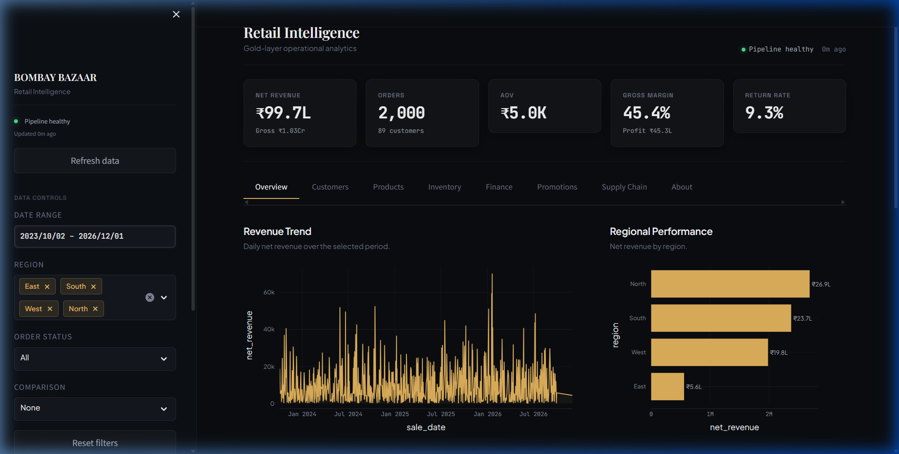
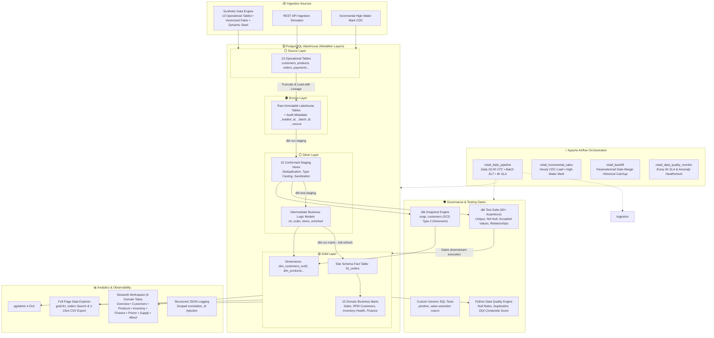
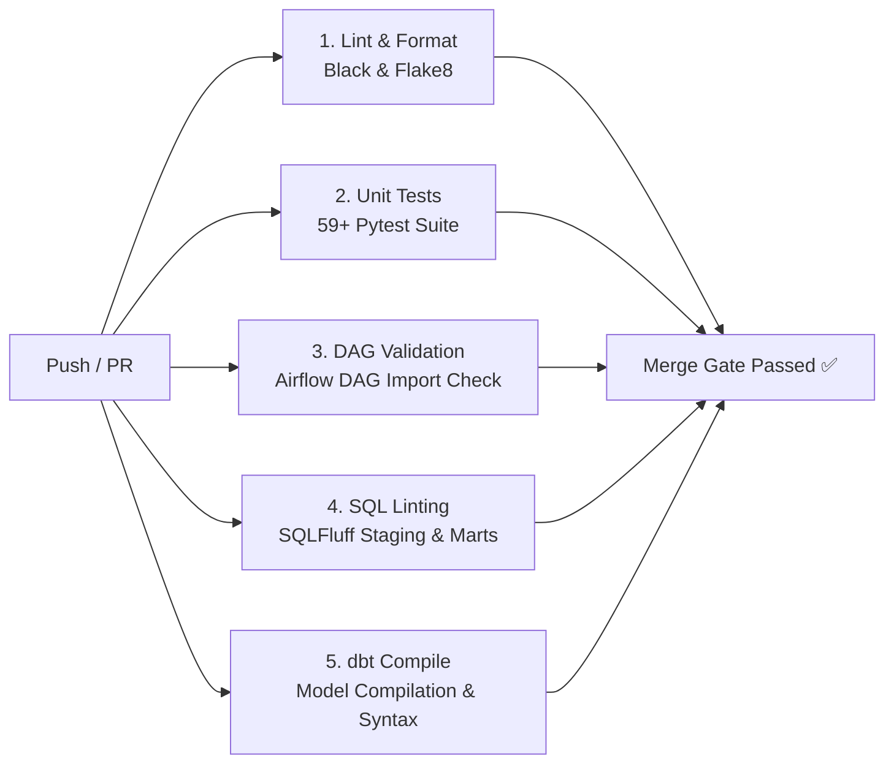

<div align="center">

#Enterprise Retail ELT Platform
### Production-Grade Modern Data Stack & Glassmorphic Analytics Workspace

**An end-to-end ELT data platform processing 13 operational tables through a Medallion Architecture (Bronze → Silver → Gold) on PostgreSQL, orchestrating daily & CDC incremental runs via Apache Airflow, transforming models with dbt Core, enforcing 60+ data quality gates, and delivering a glassmorphic analytical intelligence workspace.**

<br/>

[](https://github.com/Soham-Barate/retail-elt-pipeline/actions/workflows/ci.yml)
[](https://python.org)
[](https://airflow.apache.org)
[](https://getdbt.com)
[](https://postgresql.org)
[](https://docker.com)
[](https://streamlit.io)
[](LICENSE)

<br/>

[Live Preview](#-live-analytics-preview) · [Key Capabilities](#-key-capabilities) · [Medallion Architecture](#-medallion-lakehouse-architecture) · [Data Modeling](#-star-schema--data-marts) · [Analytics Workspace](#-glassmorphic-analytics-workspace) · [Quick Start](#-quick-start) · [Recruiter Demo](#-recruiter--interview-walkthrough) · [Repository Structure](#-repository-structure) · [Engineering Decisions](#-engineering-design-decisions)

<br/>

</div>

---

## 📸 Live Analytics Preview

<div align="center">
  
  <p><em>Figure 1: Bombay Bazaar Retail Intelligence workspace featuring glassmorphic telemetry, real-time KPI rail, adaptive Indian Rupee formatting, 8 domain tabs, and zero-white dark scrollbars.</em></p>
</div>

---

## ⚡ Key Capabilities

<table>
  <tr>
    <td width="50%">
      <h3>🥉 Medallion Data Lakehouse</h3>
      <p>Strict schema isolation in PostgreSQL: <code>source</code> (operational landing) → <code>bronze</code> (raw immutable append-only with audit lineage <code>_loaded_at</code>, <code>_batch_id</code>, <code>_source</code>) → <code>silver</code> (13 conformed, deduplicated staging models) → <code>gold</code> (star schema facts & 15 business marts).</p>
    </td>
    <td width="50%">
      <h3>🛡️ 60+ Data Quality Gates</h3>
      <p>Automated quality assurance combining 60+ declarative dbt schema tests, foreign key referential integrity checks, domain range validations, custom generic SQL macros (<code>positive_value</code>), and an automated Python Data Quality Index (DQI) reporting engine.</p>
    </td>
  </tr>
  <tr>
    <td width="50%">
      <h3>⏳ SCD Type 2 Historical Tracking</h3>
      <p>Automated Slowly Changing Dimension (SCD Type 2) tracking on customer profiles via dbt snapshots (<code>snap_customers.sql</code>), capturing historical attribute changes over time with deterministic <code>dbt_valid_from</code> and <code>dbt_valid_to</code> windowing.</p>
    </td>
    <td width="50%">
      <h3>⚡ High-Water Mark Incremental CDC</h3>
      <p>Parameterized Change Data Capture (CDC) extractor loading only newly transacted records (<code>order_date > MAX(order_date)</code>) to optimize warehouse I/O and network bandwidth, complemented by automated daily full-refresh batch reconciliation.</p>
    </td>
  </tr>
  <tr>
    <td width="50%">
      <h3>🎲 Dynamic Simulation Engine</h3>
      <p>Vectorized synthetic data generator utilizing Faker with dynamic timestamp seeding (<code>int(time.time())</code>). Every Airflow DAG retrigger dynamically generates brand new transactions, order dates, and revenue metrics across the past 3 years.</p>
    </td>
    <td width="50%">
      <h3>💎 Glassmorphic Intelligence UI</h3>
      <p>Executive analytics workspace built in Streamlit & Plotly featuring a custom 4-font typography system (<em>Playfair Display</em>, <em>Plus Jakarta Sans</em>, <em>Space Grotesk</em>, <em>JetBrains Mono</em>), adaptive currency formatting (₹Cr, ₹L, ₹K), and an Excel-style full-page raw data explorer.</p>
    </td>
  </tr>
</table>

---

## 🏗️ Medallion Lakehouse Architecture

The platform models a complete enterprise retail data lifecycle, ingesting and transforming data across 4 distinct storage tiers:


```mermaid
flowchart TB
    subgraph Sources["📦 Ingestion Sources"]
        GEN["Synthetic Data Engine<br/><i>13 Operational Tables • Vectorized Faker • Dynamic Seed</i>"]
        REST["REST API Ingestion Simulator"]
        CDC["Incremental High-Water Mark CDC"]
    end

    subgraph Airflow["🎯 Apache Airflow Orchestration"]
        DAG_DAILY["retail_daily_pipeline<br/><i>Daily 02:00 UTC • Batch ELT • 4h SLA</i>"]
        DAG_INC["retail_incremental_sales<br/><i>Hourly CDC Load • High-Water Mark</i>"]
        DAG_BACKFILL["retail_backfill<br/><i>Parameterized Date-Range Historical Catchup</i>"]
        DAG_QUAL["retail_data_quality_monitor<br/><i>Every 6h SLA & Anomaly Healthcheck</i>"]
    end

    subgraph Warehouse["🗄️ PostgreSQL Warehouse (Medallion Layers)"]
        direction TB
        subgraph S_SRC["⚪ Source Layer"]
            T_SRC["13 Operational Tables<br/><i>customers, products, orders, payments...</i>"]
        end
        subgraph S_BRZ["🟠 Bronze Layer"]
            T_BRZ["Raw Immutable Lakehouse Tables<br/><i>+ Audit Metadata: _loaded_at, _batch_id, _source</i>"]
        end
        subgraph S_SLV["⚪ Silver Layer"]
            T_STG["13 Conformed Staging Views<br/><i>Deduplication, Type Casting, Sanitization</i>"]
            T_INT["Intermediate Business Logic Models<br/><i>int_order_items_enriched</i>"]
        end
        subgraph S_GLD["🟡 Gold Layer"]
            T_FCT["Star Schema Fact Table: fct_orders"]
            T_DIM["Dimensions: dim_customers_scd2, dim_products..."]
            T_MARTS["15 Domain Business Marts<br/><i>Sales, RFM Customers, Inventory Health, Finance</i>"]
        end
        T_SRC -->|Truncate & Load with Lineage| T_BRZ
        T_BRZ -->|dbt run staging| T_STG
        T_STG -->|dbt test staging| T_INT
        T_INT -->|dbt run marts --full-refresh| T_FCT
        T_INT --> T_DIM
        T_FCT --> T_MARTS
    end

    subgraph Quality["🛡️ Governance & Testing Gates"]
        TEST_DBT["dbt Test Suite (60+ Assertions)<br/><i>Unique, Not Null, Accepted Values, Relationships</i>"]
        TEST_CUSTOM["Custom Generic SQL Tests<br/><i>positive_value assertion macro</i>"]
        SNAP_SCD2["dbt Snapshot Engine<br/><i>snap_customers (SCD Type 2 Dimension)</i>"]
        PY_REPORT["Python Data Quality Engine<br/><i>Null Rates, Duplication, DQI Composite Score</i>"]
    end

    subgraph Presentation["📊 Analytics & Observability"]
        APP["Streamlit Workspace (8 Domain Tabs)<br/><i>Overview • Customers • Products • Inventory • Finance • Promo • Supply • About</i>"]
        EXP["Full-Page Data Explorer<br/><i>gold.fct_orders Search & 1-Click CSV Export</i>"]
        PG["pgAdmin 4 GUI"]
        LOGS["Structured JSON Logging<br/><i>Scoped correlation_id Injection</i>"]
    end

    GEN --> S_SRC
    REST --> S_SRC
    CDC --> S_SRC
    T_STG --> TEST_DBT
    TEST_DBT -->|Gates downstream execution| S_GLD
    T_STG --> SNAP_SCD2 --> T_DIM
    S_GLD --> PY_REPORT
    S_GLD --> APP
    S_GLD --> EXP
    S_GLD --> PG

    DAG_DAILY -.-> Ingestion
    DAG_DAILY -.-> Warehouse
    DAG_DAILY -.-> Quality
```

---

## 🗂️ Star Schema & Data Marts

### Dimensional Model (`gold` Schema)
The analytical marts are centered around a high-performance **Star Schema** with `fct_orders` as the central transaction fact:

```
                          ┌────────────────────────┐
                          │   dim_customers_scd2   │
                          │────────────────────────│
                          │ customer_id (PK)       │
                          │ customer_name          │
                          │ customer_city          │
                          │ loyalty_tier           │
                          │ dbt_valid_from         │
                          │ dbt_valid_to           │
                          │ is_current             │
                          └───────────┬────────────┘
                                      │ 1
                                      │
                                      │ N
┌────────────────────────┐ 1        N ┌────────────────────────┐ N        1 ┌────────────────────────┐
│      dim_products      │────────────┤       fct_orders       ├────────────│       dim_stores       │
│────────────────────────│            │────────────────────────│            │────────────────────────│
│ product_id (PK)        │            │ order_item_id (PK)     │            │ store_id (PK)          │
│ product_name           │            │ order_id               │            │ store_name             │
│ category_name          │            │ customer_id (FK)       │            │ region                 │
│ cost_price             │            │ product_id (FK)        │            │ store_type             │
│ retail_price           │            │ store_id (FK)          │            │ city                   │
└────────────────────────┘            │ order_date             │            └────────────────────────┘
                                      │ order_status           │
                                      │ quantity               │
                                      │ unit_price             │
                                      │ discount_amount        │
                                      │ line_total_gross       │
                                      │ line_total_net         │
                                      │ gross_profit           │
                                      │ dbt_updated_at         │
                                      └────────────────────────┘
```

### Domain Marts Catalog

| Mart Table | Domain | Description | Business Purpose |
|---|---|---|---|
| `gold.fct_orders` | Sales | Granular line-item transaction fact table | Core grain for all revenue and quantity aggregations |
| `gold.daily_sales` | Sales | Daily net revenue, order volume, running totals & 7-day moving avg | Executive revenue pacing & trend detection |
| `gold.monthly_sales` | Sales | Month-over-month revenue growth, order volume, and AOV | Strategic executive quarterly reviews |
| `gold.revenue_by_region` | Sales | Regional revenue contribution, total orders, and average margin | Geographic territory optimization |
| `gold.top_products` | Products | Product sales ranking, total units sold, and cumulative 80/20 Pareto % | Inventory allocation and catalog rationalization |
| `gold.gross_margin` | Products | Profit margin breakdown by product, category, and margin tier | Pricing strategy & profitability protection |
| `gold.customer_lifetime_value`| Customers | Historical spend, purchase frequency, and RFM segmentation score | VIP identification & customer tiering |
| `gold.churn_risk` | Customers | Inactivity scoring, days-since-last-order, and win-back priority | Churn prevention campaign automation |
| `gold.repeat_customer_rate` | Customers | First-time vs. repeat buyer cohort retention analysis | Retention measurement & loyalty evaluation |
| `gold.dim_customers_scd2` | Customers | Slowly Changing Dimension Type 2 tracking customer demographic shifts | Historical attribution & audit compliance |
| `gold.stock_alerts` | Inventory | Multi-tier stockout warning severity (`critical`, `warning`, `normal`) | Automated warehouse replenishment alerts |
| `gold.inventory_turnover` | Inventory | Inventory turnover velocity ratios and stock efficiency | Working capital optimization |
| `gold.refund_analysis` | Finance | Return rates by category, return reasons, and refunded revenue | Quality assurance & vendor evaluation |
| `gold.payment_success_rate`| Finance | Transaction success rates across UPI, Credit Card, Netbanking, COD | Payment gateway SLA & checkout optimization |
| `gold.supplier_performance`| Supply Chain | On-time delivery rates, fulfillment lead times, and return rates | Supplier contract negotiation & vendor scoring |

---

## 💎 Glassmorphic Analytics Workspace

The dashboard ([`dashboard/app.py`](file:///d:/Soham_1/retail-elt-pipeline/dashboard/app.py) & [`dashboard/ui.py`](file:///d:/Soham_1/retail-elt-pipeline/dashboard/ui.py)) provides a tailored executive workspace built with custom CSS tokens, modern typography, and zero-dependency offline resilience:

### 1. Curated 4-Font Typography System
* **Brand Identity & Display Titles**: `Playfair Display` — High-end editorial serif imparting luxury warmth (*Bombay Bazaar*, *Retail Intelligence*).
* **Interface Controls, Filters & Body**: `Plus Jakarta Sans` — Crisp modern geometric neo-grotesque ensuring legible reading across all screen sizes.
* **Category Kickers & Section Badges**: `Space Grotesk` — Technical uppercase labels with generous letter tracking (`letter-spacing: 0.08em`).
* **Financial Data & Metrics**: `JetBrains Mono` — Monospaced tabular figures (`font-variant-numeric: tabular-nums`) ensuring strict vertical alignment for numbers, percentages, timestamps, and Indian Rupee figures.

### 2. Zero-White Scrollbars & Form Aesthetics
* **Elimination of White Viewport Scrollbars**: Native Chromium and WebKit engines on Windows often inject white scrollbars on dark backgrounds. This is prevented by enforcing `color-scheme: dark !important` across `:root`, `html`, `body`, and table containers with custom `6px` translucent thumbs.
* **Dark Form Controls**: Sidebar Date Range input is custom-styled in dark charcoal (`#14171d`) with gold monospace text. Multi-select region chips are rendered in warm translucent champagne gold badges (`rgba(223, 177, 91, 0.12)`) replacing default red chips.
* **Adaptive Currency Formatting**: Formats transaction sums adaptively with the Indian Rupee symbol:
  $$\text{Value} \ge 1\text{ Crore} \implies \text{₹X.XX Cr} \quad\mid\quad \text{Value} \ge 1\text{ Lakh} \implies \text{₹XX.X L} \quad\mid\quad \text{Value} \ge 1\text{ Thousand} \implies \text{₹X.X K}$$

### 3. Feature Breakdown Across 8 Domain Tabs
1. **Overview**: Executive KPI rail with Net Revenue, Orders, AOV, Gross Margin, and Return Rate; daily revenue area trendline; horizontal regional bars with non-clipped labels; Sales Performance matrix table; Order Status Mix; and Revenue by Region donut.
2. **Customers**: RFM Customer Segments distribution, CLV histogram, and high-priority At-Risk/Churned win-back queue.
3. **Products**: Top Products by Revenue, Profitability & Margin Tier breakdown, and Cumulative Revenue 80/20 Pareto curve.
4. **Inventory**: Multi-tier Stock Alerts (*Critical*, *Warning*, *Normal*), low stock telemetry, and Inventory Turnover velocity metrics.
5. **Finance**: Payment Gateway Reliability tiers, Refund Rate by Category, and Daily Refund volume trends.
6. **Promotions**: Promotional campaign ROI matrix (incremental revenue, discount depth, order lift).
7. **Supply Chain**: Carrier Delivery Performance, Shipping Mode distribution, and On-Time Delivery rates.
8. **About**: Dynamic Executive Insights calculated live from active filters, end-to-end Medallion Pipeline Architecture, Metric Definitions, and Data Lineage.
9. **Interactive Full-Page Data Explorer**: Searchable, filterable Excel-style raw data grid for `gold.fct_orders` with one-click CSV export.

---

## 🚀 Quick Start

### Prerequisites
* [Docker Desktop](https://www.docker.com/products/docker-desktop) (Docker Compose v2+)
* 4 GB+ RAM allocated to Docker daemon

### 1. Clone & Launch Stack
```bash
git clone https://github.com/Soham-Barate/retail-elt-pipeline.git
cd retail-elt-pipeline

# Start all platform services in the background
docker compose up -d
```

### 2. Verify Services & Port Access
Once launched, all microservices are accessible locally:

| Service | URL | Credentials | Purpose |
|---|---|---|---|
| **Streamlit Workspace** | [http://localhost:8501](http://localhost:8501) | *No auth required* | Executive analytics & raw data explorer |
| **Airflow Webserver** | [http://localhost:8080](http://localhost:8080) | `airflow` / `airflow` | DAG orchestration & pipeline monitoring |
| **pgAdmin 4 GUI** | [http://localhost:5050](http://localhost:5050) | `admin@retail.com` / `admin` | PostgreSQL warehouse database client |
| **PostgreSQL Port** | `localhost:5432` | `retail_user` / `retail_pass_change_me` | Direct JDBC/ODBC/psql warehouse access |

---

## 🎥 Recruiter / Interview Walkthrough

Follow this 5-step walkthrough when presenting this project in technical interviews:

### Step 1: Healthcheck & Container Isolation
Show container status using `docker compose ps`. Demonstrate that PostgreSQL, Airflow, and Streamlit are healthy with non-root isolation and mapped volumes.

### Step 2: Triggering the Airflow Daily Pipeline
Open the **Airflow UI (localhost:8080)** and trigger `retail_daily_pipeline`. Walk through the execution sequence:
* **Ingestion**: `generate_source_data` uses Faker with dynamic time seeds (`int(time.time())`) generating 2,000 new transactions, followed by `load_bronze_layer` adding audit lineage columns.
* **Transformation**: dbt staging models clean, cast, and deduplicate into Silver views.
* **Testing**: 60+ dbt tests validate schema integrity and domain bounds before building Gold.
* **Marts**: `dbt_sales_mart` runs with `--full-refresh` to guarantee `fct_orders` is fully updated, followed by concurrent dimensional mart builds.
* **SCD2 Snapshot**: `dbt_snapshot_customers` captures customer demographic shifts.

### Step 3: Verifying Fresh Data in PostgreSQL
Connect via terminal or pgAdmin and run:
```sql
SELECT count(*) as total_orders, sum(line_total_net) as net_revenue, max(order_date) as latest_tx
FROM gold.fct_orders;
```
Show that transaction volumes and revenue reflect the freshly triggered batch.

### Step 4: Streamlit Live Cache Busting
Navigate to **Streamlit (localhost:8501)**. Click **"Refresh data"** in the sidebar:
* Streamlit executes `st.cache_data.clear()` and `st.rerun()`.
* All KPI blocks (Net Revenue, Orders, AOV, Gross Margin), trend charts, and tables update in real time with the new batch figures.
* Show the **"Pipeline healthy · 0m ago"** status dot.

### Step 5: Full-Page Raw Data Explorer
Click **"Data Explorer"** in the sidebar:
* Displays the complete `gold.fct_orders` dataset in a clean virtualized table.
* Filter rows on the fly with the search bar.
* Export filtered or complete datasets using the **"Download CSV"** button.

---

## 📁 Repository Structure

```
retail-elt-pipeline/
├── .github/workflows/
│   └── ci.yml                      # 5-job GitHub Actions CI pipeline
├── configs/
│   └── pipeline.yml                # Central YAML configuration & database credentials
├── dags/                           # Production Airflow DAGs
│   ├── common/
│   │   ├── __init__.py
│   │   └── callbacks.py            # Structured failure & SLA alert callbacks
│   ├── retail_elt_dag.py           # Daily full pipeline (Generate → Bronze → Silver → Gold)
│   ├── incremental_sales_dag.py    # Hourly CDC incremental load (High-Water Mark)
│   ├── backfill_dag.py             # Parameterized historical backfill DAG
│   └── data_quality_dag.py         # Standalone 6-hour quality & SLA monitor
├── dashboard/                      # Retail Intelligence Analytics Workspace
│   ├── .streamlit/
│   │   └── config.toml             # Streamlit dark theme tokens & color definitions
│   ├── app.py                      # Multi-tab analytics dashboard & Data Explorer
│   ├── ui.py                       # Design system (typography, glassmorphism, chart theme, formatters)
│   └── requirements.txt            # Streamlit dependencies
├── dbt_retail/                     # dbt Core transformation project
│   ├── macros/                     # Custom SQL macros & test_positive_value
│   ├── models/
│   │   ├── staging/                # 13 silver staging models & schema assertions
│   │   ├── intermediate/           # Ephemeral business logic joins
│   │   └── marts/                  # Gold layer business marts (Sales, Customers, Inventory, Finance)
│   ├── snapshots/                  # snap_customers.sql (SCD Type 2)
│   └── dbt_project.yml
├── docs/                           # Architecture guides & data dictionaries
│   ├── images/
│   │   └── dashboard_preview.png   # High-resolution dashboard screenshot
│   ├── architecture.md             # In-depth architectural & scaling guide
│   ├── data_dictionary.md          # Full warehouse table & column reference
│   └── deployment.md               # Production deployment runbook
├── scripts/                        # Ingestion & automation scripts
│   ├── init_demo.sh                # Automated bootstrap script
│   ├── data_generator.py           # 13-table Faker generation with dynamic seeds
│   ├── bronze_loader.py            # Source → Bronze loader with audit metadata
│   ├── incremental_loader.py       # SQL-injection-safe CDC high-water mark loader
│   └── api_simulator.py            # REST API ingestion simulator
├── src/                            # Core Python library
│   ├── config.py                   # Type-safe configuration dataclasses
│   ├── db.py                       # Connection manager, transactions & retry backoff
│   ├── logger.py                   # Scoped structured JSON logger with correlation IDs
│   ├── quality.py                  # Automated data quality report generator
│   └── utils.py                    # Timer, chunking, and validation utilities
├── streaming/                      # Optional PySpark & Kafka streaming module
│   ├── spark_streaming.py          # Real-time streaming consumer (isolated)
│   └── requirements-streaming.txt  # Isolated streaming dependencies
├── tests/                          # 59+ automated unit & integration tests
│   ├── test_bronze_loader.py       # Bronze layer metadata & batch tests
│   ├── test_config.py              # Configuration validation tests
│   ├── test_dag_import.py          # Airflow DAG parse & structural tests
│   ├── test_dashboard.py           # Streamlit compilation & render tests
│   ├── test_data_generator.py      # Faker generation & edge case tests
│   ├── test_incremental_loader.py # CDC logic & SQL-injection protection tests
│   ├── test_quality.py             # Data quality scoring tests
│   └── test_utils.py               # Utility & edge case tests
├── docker-compose.yml              # Multi-container production stack
├── docker-compose.streaming.yml    # Optional Kafka/Zookeeper stack
├── Makefile                        # 15+ developer automation targets
├── requirements.txt                # Core production dependencies
└── requirements-dev.txt            # Test & linting dependencies
```

---

## 🧠 Engineering Design Decisions

### 1. Medallion Schemas vs. Single Flat Database
* **Decision**: Implement isolated schemas (`source`, `bronze`, `silver`, `gold`) within PostgreSQL.
* **Trade-off**: Requires schema permission management and cross-schema references.
* **Rationale**: Enforces logical boundary separation between raw immutable landing data, conformed clean models, and user-facing business marts. Prevents analytics queries from impacting raw ingestion and makes migration to Snowflake or BigQuery a drop-in replacement.

### 2. High-Water Mark CDC vs. Full Table Refreshes
* **Decision**: Implement incremental high-water mark extraction in [`scripts/incremental_loader.py`](file:///d:/Soham_1/retail-elt-pipeline/scripts/incremental_loader.py) and dbt incremental materializations.
* **Trade-off**: Requires tracking state and timestamp indexes.
* **Rationale**: In production retail environments with millions of daily transactions, full refreshes degrade warehouse I/O and network bandwidth. The high-water mark loads only records where `order_date > MAX(order_date)`.

### 3. Native dbt Snapshots vs. Custom Python SCD2
* **Decision**: Implement `snap_customers.sql` using dbt's native snapshot mechanism.
* **Trade-off**: Adds a dependency on dbt snapshot state management.
* **Rationale**: Hand-rolling SCD2 merges in Python is prone to race conditions and lock contention. dbt handles snapshot state comparison, effective date windowing (`dbt_valid_from`, `dbt_valid_to`), and null termination natively and deterministically.

### 4. Idempotent Ingestion with Transaction Safety
* **Decision**: Wrap Bronze loader table updates inside explicit database transaction blocks using `TRUNCATE` rather than `DROP TABLE`.
* **Trade-off**: Requires maintaining existing table schema structures.
* **Rationale**: Dropping tables breaks dependent PostgreSQL views created by dbt staging models. Truncating inside a transaction guarantees idempotency while keeping view dependencies intact.

---

## 🛠️ Automated CI/CD Pipeline

The project features a hardened 5-job GitHub Actions workflow ([`.github/workflows/ci.yml`](file:///d:/Soham_1/retail-elt-pipeline/.github/workflows/ci.yml)) triggered on every push and pull request:


```mermaid
flowchart LR
    A[Push / PR] --> B[1. Lint & Format<br/>Black & Flake8]
    A --> C[2. Unit Tests<br/>59+ Pytest Suite]
    A --> D[3. DAG Validation<br/>Airflow DAG Import Check]
    A --> E[4. SQL Linting<br/>SQLFluff Staging & Marts]
    A --> F[5. dbt Compile<br/>Model Compilation & Syntax]
    B & C & D & E & F --> G[Merge Gate Passed ✅]
```

---

## 📝 Resume & Portfolio Summary

* **Architected** an enterprise-grade retail ELT platform processing **13 operational data sources** through a **Medallion Architecture** (Bronze/Silver/Gold) on PostgreSQL and dbt Core.
* **Orchestrated** 4 Apache Airflow DAGs featuring task groups, execution timeouts, custom SLA monitoring, and structured JSON failure alerting.
* **Enforced** **60+ dbt tests** (schema, referential integrity, domain accepted values, and custom generic SQL assertions) combined with an automated Python data quality scoring engine.
* **Engineered** an **SCD Type 2 customer dimension** using dbt snapshots and an incremental CDC pipeline with parameterized high-water mark extraction.
* **Designed & Built** a modern glassmorphic Streamlit intelligence workspace with a custom 4-font typography hierarchy, adaptive Indian Rupee formatting, 8 domain analytical tabs, and an interactive full-page raw data explorer.
* **Established** a complete CI/CD automation pipeline using **GitHub Actions** enforcing linting, 59+ automated pytest test cases, SQLFluff validation, and dbt compilation.

---

## 📄 License

This project is licensed under the MIT License — see the [LICENSE](LICENSE) file for details.

<div align="center">

**Built by [Soham Barate](https://github.com/Soham-Barate)**  
*Data Engineer • [GitHub](https://github.com/Soham-Barate)*

</div>
